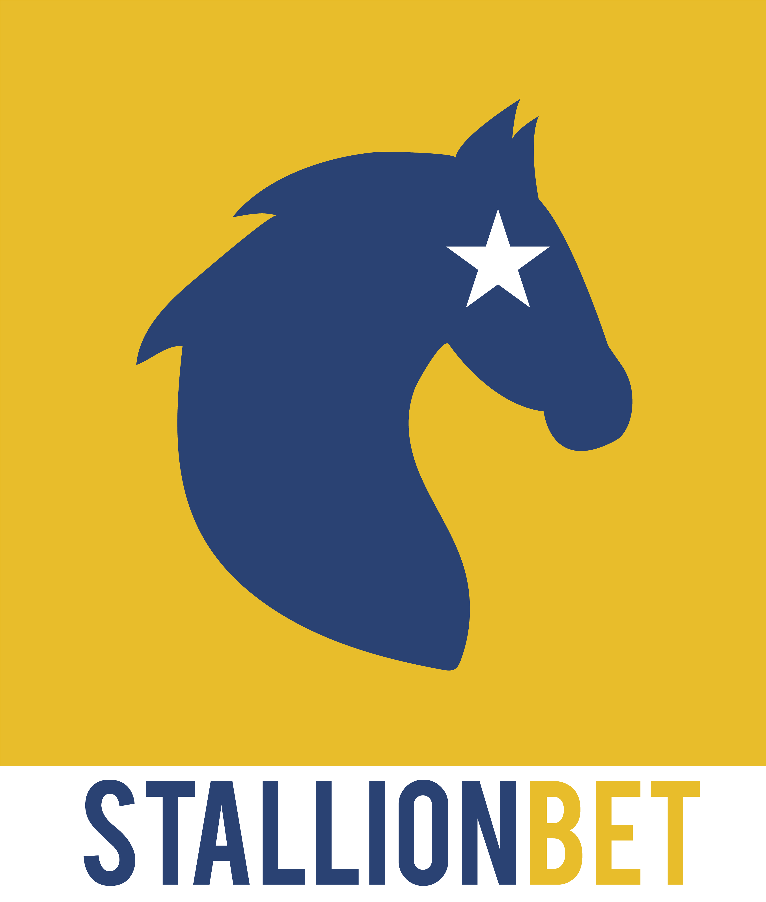

# StallionBet
Sky Test

[![LinkedIn][linkedin-shield]][linkedin-url]

<!-- PROJECT LOGO -->
 

  

  <h3 align="center">Stallion Bet</h3>

  

    A project by Lorenzo Masucci
     
    <a href="https://github.com/masucci/StallionBet"><strong>Explore the docs »</strong></a>
     
     
    <a href="https://drive.google.com/">View Demo</a>
  

<!-- ABOUT THE PROJECT -->
## About The Project

![Product Name Screen Shot][product-screenshot]

In this project, I've displayed all the items in a TableView. I also added some features like, Dark mode, different labels to improve the UX/UI.

The logo was created with illustrator.

I was careful to write a clean code, refactoring and do some improvements after the first writing. :smile:

### Built With
The project was entirely coded in Swift.
* [Swift](https://swift.org/)
* [UIKit](https://developer.apple.com/documentation/uikit)
* [SafariServices](https://developer.apple.com/documentation/safariservices)

### Contact me
For more information about me, here you can find some contacts:
* :link: Website: (https://www.lorenzomasucci.fun/)
* :bust_in_silhouette: Linkedin: (https://www.linkedin.com/in/lorenzo-masucci/)
* [:email:  Email](mailto:lorenzo.masucci@outlook.com)

<!-- MARKDOWN LINKS & IMAGES -->
[linkedin-shield]: https://img.shields.io/badge/-LinkedIn-black.svg?style=flat-square&logo=linkedin&colorB=555
[linkedin-url]: https://www.linkedin.com/in/lorenzo-masucci/
[product-screenshot]: images/example.png
